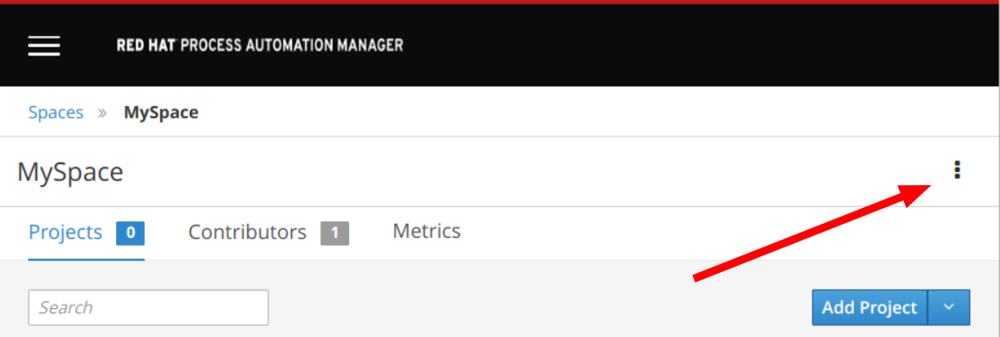
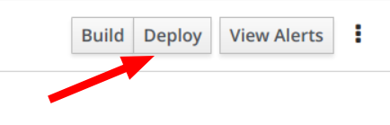
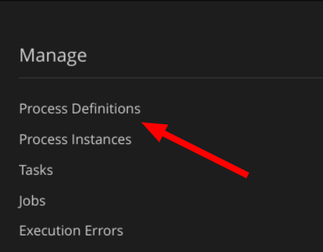
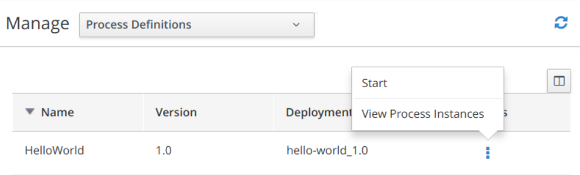

RHPAM Hello World!
================================================================

**Red Had Process Automation Manager** is 100% open source and the upstream effort is known as [jBPM](http://www.jbpm.org).

Hello World process
---------------------------------------------------------------------

It's a really simple process:

- expect a name as input parameter
- the first human task has a form with "Hello" and name text field
- last task print the "Hello \<name\>" in the system out

How to import this demo project
---------------------------------------------------------------------

This repository can be imported in your Business Central following these steps:

1. From Home page *click* **Design**
2. In header section where is the space name (e.g. myteam) *select the kebab icon* (the 3 vertical dots icon)

	

3. *Select* **Import Project**
4. *Fill the* **Repository URL** field with this github repository http URL and, finally, *select* **Import**

Deploy
---------------------------------------------------------------------

1. Open `hello-world` project
2. *Click* in the up right corner the **Deploy** button

	
   
Test the process
---------------------------------------------------------------------

1. In upper bar, *select* **Menu** and then **Process Definitions**

	

2. In the `hello-world` row, from kebab menu *click* **start**

	

3. In the dialogue box, *fill* the **name** field and *click* **Submit**
4. Check the process status in the **Diagram** tab
5. In upper bar, *select* **Menu** and then **Tasks**
6. *Click* the **Hello** task
7. *Click* the **Claim** button
8. *Click* the **Start** button
9. You can change the name
10. *Click* the **Complete** button
11. In upper bar, *select* **Menu** and then **Process Instances**
12. In the left side bar, *flag* **completed** state
13. You will find the completed process instance